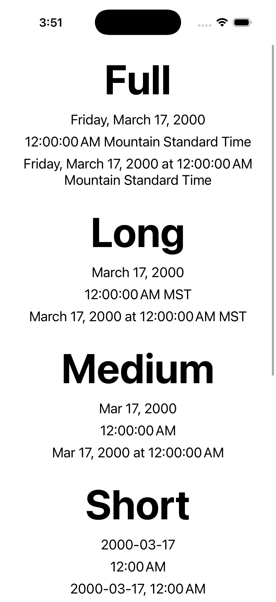
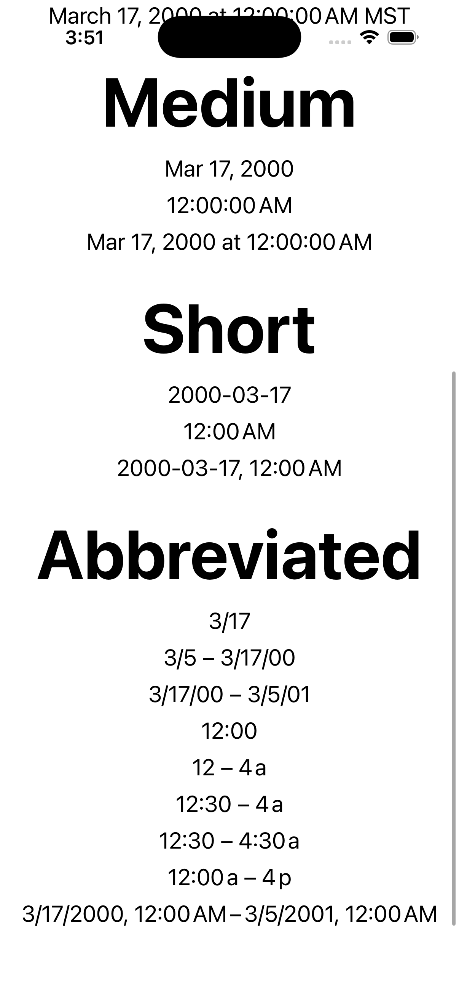

# react-native-date-i18n

A React Native library to handle localizing date objects to the user's device settings

## Installation


```sh
# Using yarn
yarn add react-native-date-i18n

# Using npm
npm install react-native-date-i18n
```


## Usage


```js
import {
  DateType,
  formatDate,
  formatTime,
  formatDateTime,
  formatAbbreviatedShortDate,
  formatAbbreviatedShortDateRange,
  formatAbbreviatedShortTime,
  formatAbbreviatedShortTimeRange
} from 'react-native-date-i18n';

formatDate(testDate, DateType.long);
formatTime(testDate, DateType.medium);
formatDateTime(testDate, DateType.full, DateType.short);
formatAbbreviatedShortDate(testDate);
formatAbbreviatedShortDateRange(testDate, testDate2);
formatAbbreviatedShortTime(testDate);
formatAbbreviatedShortTimeRange(testDate, testDate2);
```

The `DateType` options map onto values of the same names across both operating systems:

 * [iOS Formats](https://developer.apple.com/documentation/foundation/dateformatter/style)
 * [Android Formats](https://developer.android.com/reference/java/time/format/FormatStyle)

### Screenshots

<div style="display: flex;flex-direction:row">
  
  
</div>


## Contributing

- [Development workflow](CONTRIBUTING.md#development-workflow)
- [Sending a pull request](CONTRIBUTING.md#sending-a-pull-request)
- [Code of conduct](CODE_OF_CONDUCT.md)

## License

MIT

---

Made with [create-react-native-library](https://github.com/callstack/react-native-builder-bob)
